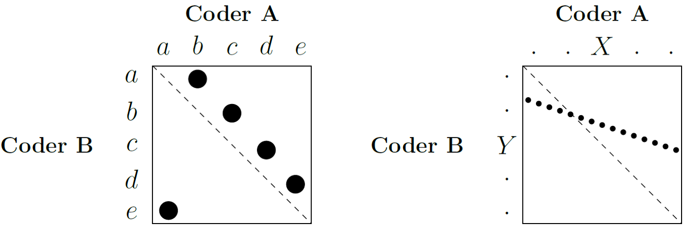
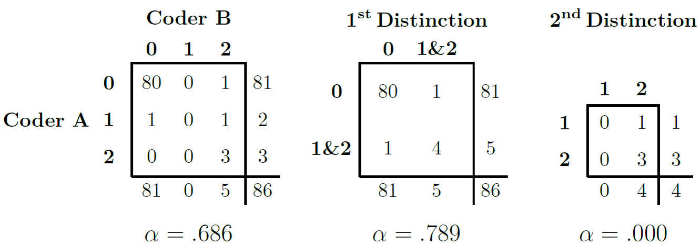

We could say that the central tenet of quantitative text analysis, which sets it apart from other approaches to analyzing text, is that it strives to be objective and replicable. In measurement theory, we use the terms **reliability** and **validity** to convey this message.

Reliability refers to consistency, that is, the degree to which we get similar results whenever we apply a measuring instrument to measure a given concept. This is similar to the concept of *replicability*. Validity, on the other hand, refers to unbiasedness, that is, the degree to which our measure really measures the concept which intends to measure. In other words, validity looks whether the measuring instrument that we are using is objective.

@Carmines1979a distinguish among three types of validity. *Content Validity*, which refers to whether our measure represents all facets of the construct of interest; *criterion Validity*, which looks at whether our measure correlates with other measures of the same concept, and *construct Validity*, which looks at whether our measure behaves as expected within a given theoretical context.
I should also say here, that the three types of validity are not interchangeable. Ideally, one has to prove that their results pass all three validity tests. In the words of @Grimmer2013a: "Validate, validate, validate"!

@Krippendorff2004a distinguishes among three types of reliability. *Stability*, which he considers as the weakest form of coding reliability, and which can be measured when the same text is coded by the same coder more than once, *reproducibility*, which is measured by the degree of agreement among independent coders, and *accuracy*, which he considers as the strongest form of coding reliability, and which is measured by the agreement between coders and a given standard. However, in the absence of a benchmark, we are usually interested in measuring reliability as reproducibility, in other words as inter-coder agreement.

## Measuring inter-coder agreement

@Hayes2007a [p.79] argue that a good measure of the agreement should at least address five criteria. The first is that it should apply to many coders, and not only two. Also, when we use the method for more coders, there should be no difference in how many coders we include. The second is that the method should only take into account the actual number of categories the coders used and not all that were available. This as while the designers designed the coding scheme on what they thought the data would look like, the coders use the scheme based on what the data is. Third, it should be numerical, meaning that we can use it to make a scale between 0 (absence of agreement) and 1 (perfect agreement). Fourth, it should be appropriate for the level of measurement. So, if our data is ordinal or nominal, we should not use a measure that assumes metric data. This ensures that the metric uses all the data and that it does not add or not use other information. Fifth, we should be able to compute (or know), the sampling behaviour of the measure. 

With these criteria in mind, we see that popular methods, such as % agreement or Pearson's *r*, can be misleading. Especially for the latter - as it is a quite popular method - this often leads to problems, as this figure by @Krippendorff2004a shows:

```{r out.width = "75%", fig.align = "center", echo=FALSE}
 
``` 

Here, the figure on the left shows two coders: A and B. The dots in the figure show the choices both coders made, while the dotted line shows the line of perfect agreement. If a dot is on this line, it means that both Coder A and Coder B made the same choice. In this case, they disagreed in all cases. When Coder A chose *a*, Coder B chose *e*, when Coder A chose *b*, Coder B chose *a*, and so on. Yet, when we would calculate Pearson's *r* for this, we would find a result as shown in the right-hand side of the figure. Seen this way, the agreement between both coders does not seem a problem at all. The reason for this is that Pearson's *r* works with the distances between the categories *without* taking into account their location. So, for a positive relationship, the only thing Pearson's *r* requires is that for every increase or decrease for one coder, there is a similar increase or decrease for the other. This happens here with four of the five categories. The result is thus a high Pearson's *r*, though the actual agreement should be 0. 

Pearson's *r* thus cannot fulfil all our criteria. A measure that can is Krippendorff's $\alpha$ [@Krippendorff2004a]. This measure can not only give us the agreement we need, but can also do so for nominal, ordinal, interval, and ratio level data, as well as data with many coders and missing values. Besides, we can compute 95% confidence intervals around $\alpha$ using bootstrapping, which we can use to show the degree of uncertainty around our reliability estimates.

Despite this, Krippendorff's $\alpha$ is not free of problems. One main problem occurs when coders agree on only a few categories and use these categories a considerable number of times. This leads to an inflation of $\alpha$, making it is higher than it should be [@Krippendorff2004a], as in the following example:

```{r out.width = "75%", fig.align = "center", echo=FALSE}
 
``` 

Here, in the left-most figure, we see coders A and B who have to code into three categories: 0, 1, or 2. In this example, the categories 1 and 2 carry a certain meaning, while category 0 means that the coders did not know what to assign the case to. Of the 86 cases, both coders code 80 cases in the 0 category. This means that there are only 6 cases on which they can agree or disagree about a code that carries some meaning. Yet, if we calculate $\alpha$, the result - 0.686 - takes into account all the categories. One solution for this is to add up the categories 1 and 2, as the figure in the middle shows. Here, the coders agree in 84 of the 86 cases (on the diagonal line) and disagree in only 2 of them. Calculating $\alpha$ now shows that it would increase to 0.789. Finally, we can remove the 0 category and again view 1 and 2 as separate categories (as the most right-hand figure shows). Yet, the result of this is quite disastrous. While the coders agree in 3 of the 4 cases, the resulting $\alpha$ equals 0.000, as coder B did not use category 1 at all.

Apart from these issues, Krippendorff's $\alpha$ is a stable and useful measure. A value of $\alpha$ = 1 indicates perfect reliability, while a value of $\alpha$ = 0 indicates the absence of reliability. This means that if $\alpha$ = 0, there is no relationship between the values. It is possible for $\alpha$ < 0, which means that the disagreements between the values are larger than they would be by chance and are systematic. As for thresholds, @Krippendorff2004a proposes to use either 0.80 or 0.67 for results to be reliable. Such low reliability often has many causes. One thing might be that the coding scheme is not appropriate for the documents. This means that coders had categories that they had no use for, and lacked categories they needed. Another reason might be that the coders lacked training. Thus, they did not understand how to use the coding scheme or how the coding process works. This often leads to frustration on part of the coders, as in these cases the process often becomes time-consuming and too demanding to carry out. 

To calculate Krippendorff's $\alpha$, we can use the following software:

*  KALPHA custom dialogue (SPSS)
*  **kalpha** user-written package (Stata)
*  KALPHA macro (SAS)
*  **kripp.alpha** command in **kripp.boot** package (R) - amongst others

Let us try this in R using an example. Here, we will look at the results of a coding reliability test where 12 coders assigned the sentences of the 1997 European Commission work programme in the 20 categories of a policy areas coding scheme. We can find the results for this on GitHub. To get the data, we tell R where to find it, then to read that file as a .csv file and write is to a new object:

```{r}
library(readr)

urlfile = "https://raw.githubusercontent.com/SCJBruinsma/qta-files/master/reliability_results.csv"
reliability_results <- read_csv(url(urlfile))
```

Notice that in the data frame we just created, the coders are in the columns and the sentences in the rows. As the `kripp.boot` package requires it to be the other way around and in matrix form, we first transpose the data, and then place it in a matrix. Finally, we run the command and specify we want the nominal version:

```{r, eval = FALSE}
library("kripp.boot")

reliability_results_t <- t(reliability_results)
reliability <- as.matrix(reliability_results_t)
kalpha <- kripp.boot(reliability, iter=1000, method = "nominal")
kalpha$value
```

Note also that `kripp.boot` is a GitHub package. You can still calculate the value (but without the confidence interval) with another package:

```{r, eval = FALSE}
library("DescTools")

reliability_results_t <- t(reliability_results)
reliability <- as.matrix(reliability_results_t)
kalpha <- KrippAlpha(reliability, method = "nominal")
kalpha$value
```

As we can see, the results point out that the agreement among the coders is 0.634 with an upper limit of 0.650 and a lower limit of 0.618 which is short of Krippendorff's cut-off point of 0.667.

## Visualizing the quality of coding

@Lamprianou2020 notes that existing reliability indices may mask coding problems and that the reliability of coding is not stable across coding units (as illustrated in the example given for Krippendorff's alpha in Section 3.2 above). To investigate the quality of coding he proposes using social network analysis (SNA) and exponential random graph models (ERGM). Here, we illustrate a different approach, based on the idea of sensitivity analysis. 

We therefore compare the codings of each coder against all others (and also against a benchmark or a gold standard). For this, we need to bootstrap the coding reliability results to create an uncertainty measure around each coder's results, following the approach proposed by @Benoit2009a. The idea is to use a non-parametric bootstrap for the codings of each coder (using 1000 draws with replacement) at the category level and then calculate the confidence intervals. Their width then depends on both the number of sentences coded by each coder (n) in each category and the number of coding categories that are not empty. Thus, larger documents and fewer empty categories result in narrower confidence intervals, while a small number of categories leads to wider intervals [@Lowe2011a].

To start, the first thing we do is load two packages we need into R using the `library` command:

```{r, message=FALSE}
library(Hmisc)
library(combinat)
```

In the following example we perform the sensitivity analysis on the coded sentences of the 1997 European Commission work programme, as given in Section 3.2. Here, however, the same data is arranged differently. Each row represents a coder, and each column represents a coding category (*c0* to *c19*). In each cell, we see the number of sentences that each coder coded in each category, with the column *n* giving the sum of each row:

```{r, tidy=TRUE, tidy.opts = list(width.cutoff = 60), message=FALSE}
coderid <- c("coder1","coder2","coder3","coder4","coder5","coder6","coder7","coder8","coder9","coder10","coder11","coder12")
c0 <- c(14,0,0,9,29,1,2,11,1,8,9,0)
c01 <- c(4,1,1,2,2,3,2,1,1,1,6,0)
c02 <- c(5,5,5,3,5,4,6,6,3,1,3,6)
c03 <- c(15,12,12,26,13,22,8,14,15,25,14,21)
c04 <- c(5,6,6,5,4,6,6,5,6,6,6,6)
c05 <- c(0,0,0,1,0,0,0,0,0,0,0,0)
c06 <- c(9,10,22,12,9,11,11,7,9,11,6,20)
c07 <- c(2,1,0,0,1,1,0,1,1,0,1,2)
c08 <- c(3,2,2,2,2,2,1,2,2,2,2,2)
c09 <- c(5,7,5,5,5,6,5,6,8,7,7,6)
c10 <- c(23,23,22,23,18,23,22,23,23,25,24,22)
c11 <- c(31,31,33,40,25,23,25,30,40,16,40,31)
c12 <- c(2,3,1,4,0,3,1,5,3,2,3,3)
c13 <- c(2,4,3,3,3,3,2,5,2,2,3,2)
c14 <- c(13,12,11,13,9,14,18,14,2,22,12,14)
c15 <- c(9,8,8,5,7,8,10,10,13,8,8,7)
c16 <- c(0,0,0,0,0,0,0,0,0,0,0,0)
c17 <- c(3,3,4,1,3,3,2,1,3,3,3,3)
c18 <- c(16,33,27,8,26,28,31,22,28,23,14,16)
c19 <- c(3,3,2,1,3,3,3,1,4,2,3,3)
c20 <- c(0,0,0,0,0,0,0,0,0,0,0,0)
n <- c(164, 164, 164, 163, 164, 164, 155, 164, 164, 164, 164, 164)

data_uncertainty <- data.frame(coderid, c0,c01,c02,c03,c04,c05,c06,c07,c08,c09,c10,c11,c12,c13,c14,c15,c16,c17,c18,c19,c20,n, stringsAsFactors=FALSE)
```

We then tell R how many coders we have. As this number is equal to the number of rows we have, we can get this number using the `nrow` command. We also specify the number of bootstraps we want to carry out (1000) and transform our data frame into an array. We do the latter as R needs the data in this format later on:

```{r, tidy=TRUE, tidy.opts = list(width.cutoff = 60), message=FALSE}
nman     <- nrow(data_uncertainty)
nrepl    <- 1000
manifBSn <- manifBSnRand <- array(as.matrix(data_uncertainty[,2:21]),
                                  c(nman, 20, nrepl+1),
                                  dimnames=list(1:nman,names(data_uncertainty[,2:21]), 
                                                0:nrepl))
```

We then bootstrap the sentence counts for each coder and compute percentages for each category using a multinomial draw. First, we define `p`, which is the proportion of each category over all the coders. Then, we input this value together with the total number of codes `n` into the `rmultinomial` command, which gives the random draws. As we want to do this a 1000 times, we place this command into a `for` loop:

```{r, tidy=TRUE, tidy.opts = list(width.cutoff = 60), results='hide'}
p <- manifBSn[,,1]/n

for(i in 1:nrepl) {
 manifBSn[,,i] <- rmultinomial(n, p)
 }
```

With this data, we can then ask R to compute the quantities of interest. These are standard errors for each category, as well as the percentage coded for each category:

```{r, tidy=TRUE, tidy.opts = list(width.cutoff = 60), message=FALSE}
c0SE  <- apply(manifBSn[,"c0",]/n*100, 1, sd)
c01SE <- apply(manifBSn[,"c01",]/n*100, 1, sd)
c02SE <- apply(manifBSn[,"c02",]/n*100, 1, sd)
c03SE <- apply(manifBSn[,"c03",]/n*100, 1, sd)
c04SE <- apply(manifBSn[,"c04",]/n*100, 1, sd)
c05SE <- apply(manifBSn[,"c05",]/n*100, 1, sd)
c06SE <- apply(manifBSn[,"c06",]/n*100, 1, sd)
c07SE <- apply(manifBSn[,"c07",]/n*100, 1, sd)
c08SE <- apply(manifBSn[,"c08",]/n*100, 1, sd)
c09SE <- apply(manifBSn[,"c09",]/n*100, 1, sd) 
c10SE <- apply(manifBSn[,"c10",]/n*100, 1, sd)
c11SE <- apply(manifBSn[,"c11",]/n*100, 1, sd)
c12SE <- apply(manifBSn[,"c12",]/n*100, 1, sd)
c13SE <- apply(manifBSn[,"c13",]/n*100, 1, sd)
c14SE <- apply(manifBSn[,"c14",]/n*100, 1, sd)
c15SE <- apply(manifBSn[,"c15",]/n*100, 1, sd)
c16SE <- apply(manifBSn[,"c16",]/n*100, 1, sd)
c17SE <- apply(manifBSn[,"c17",]/n*100, 1, sd)
c18SE <- apply(manifBSn[,"c18",]/n*100, 1, sd)
c19SE <- apply(manifBSn[,"c19",]/n*100, 1, sd)

per0  <- apply(manifBSn[,"c0",]/n*100, 1, mean)
per01 <- apply(manifBSn[,"c01",]/n*100, 1, mean)
per02 <- apply(manifBSn[,"c02",]/n*100, 1, mean)
per03 <- apply(manifBSn[,"c03",]/n*100, 1, mean)
per04 <- apply(manifBSn[,"c04",]/n*100, 1, mean)
per05 <- apply(manifBSn[,"c05",]/n*100, 1, mean)
per06 <- apply(manifBSn[,"c06",]/n*100, 1, mean)
per07 <- apply(manifBSn[,"c07",]/n*100, 1, mean)
per08 <- apply(manifBSn[,"c08",]/n*100, 1, mean)
per09 <- apply(manifBSn[,"c09",]/n*100, 1, mean)
per10 <- apply(manifBSn[,"c10",]/n*100, 1, mean)
per11 <- apply(manifBSn[,"c11",]/n*100, 1, mean)
per12 <- apply(manifBSn[,"c12",]/n*100, 1, mean)
per13 <- apply(manifBSn[,"c13",]/n*100, 1, mean)
per14 <- apply(manifBSn[,"c14",]/n*100, 1, mean)
per15 <- apply(manifBSn[,"c15",]/n*100, 1, mean)
per16 <- apply(manifBSn[,"c16",]/n*100, 1, mean)
per17 <- apply(manifBSn[,"c17",]/n*100, 1, mean)
per18 <- apply(manifBSn[,"c18",]/n*100, 1, mean)
per19 <- apply(manifBSn[,"c19",]/n*100, 1, mean)
```

We then bind all these quantities together in a single data frame:

```{r, tidy=TRUE, tidy.opts = list(width.cutoff = 60)}
dataBS <-data.frame(cbind(data_uncertainty[,1:22], c0SE, c01SE, c02SE, c03SE, c04SE, c05SE,c06SE, c07SE, c08SE, c09SE, c10SE, c11SE, c12SE, c13SE, c14SE, c15SE, c16SE, c17SE,c18SE, c19SE, per0, per01, per02, per03, per04, per05, per06, per07, per08, per09,per10, per11, per12, per13, per14, per15, per16, per17, per18, per19))
```

While we can now inspect the results by looking at the data, it becomes more clear when we visualise this. While R has some inbuilt tools for visualisation (in the `graphics` package), these tools are rather crude. Thus, here we will use the `ggplot2` package, which extends our options, and which has an intuitive structure:

```{r, tidy=TRUE, tidy.opts = list(width.cutoff = 60), message=FALSE}
library(ggplot2)
```

First, we make sure that the variable ``coderid`` is a factor and make sure that it is in the right order:

```{r, tidy=TRUE, tidy.opts = list(width.cutoff = 60)}
dataBS$coderid <- as.factor(dataBS$coderid)
dataBS$coderid <- factor(dataBS$coderid,levels(dataBS$coderid)[c(1,5:12,2:4)])
```

Then, we calculate the 95% confidence intervals for each category. We do so using the percent of each category and the respective standard error, and add these values to our data-set:

```{r, tidy=TRUE, tidy.opts = list(width.cutoff = 60)}
c0_lo <- per0 - (1.96*c0SE)
c0_hi <- per0 + (1.96*c0SE)
c01_lo <- per01 - (1.96*c01SE)
c01_hi <- per01 + (1.96*c01SE)
c02_lo <- per02 - (1.96*c02SE)
c02_hi <- per02 + (1.96*c02SE)

dataBS <-cbind(dataBS, c0_lo, c0_hi, c01_lo, c01_hi, c02_lo, c02_hi)
```
Finally, we generate the graphs for each individual category:

```{r, tidy=TRUE, tidy.opts = list(width.cutoff = 60)}
ggplot(dataBS,aes(per0, coderid))+
 geom_point() +
 geom_errorbarh(aes(xmax = c0_hi, xmin = c0_lo),height = .2)+
 xlab("Percentage coded to category 0")+
 ylab("Coder ID")+
 theme_classic()
```

```{r, tidy=TRUE, tidy.opts = list(width.cutoff = 60)}
ggplot(dataBS,aes(per01, coderid))+
 geom_point() +
 geom_errorbarh(aes(xmax = c01_hi, xmin = c01_lo),height = .2)+
 xlab("Percentage coded to category 01")+
 ylab("Coder ID")+
 theme_classic()
```

```{r, tidy=TRUE, tidy.opts = list(width.cutoff = 60)}
ggplot(dataBS,aes(per02, coderid))+
 geom_point() +
 geom_errorbarh(aes(xmax = c02_hi, xmin = c02_lo),height = .2)+
 xlab("Percentage coded to category 02")+
 ylab("Coder ID")+
 theme_classic()
```

Each figure shows the percentage that each of the coders coded in the respective category of the coding scheme. We thus use the confidence intervals around the estimates to look at the degree of uncertainty around each estimate. We can read the plots by looking if the dashed line is within the confidence intervals for each coder. The larger the coders deviate from the benchmark or standard, the less likely that they understood the coding scheme in the same way. It also means that it is more likely that a coder would have coded the work programme much different from the benchmark coder. Thus, such a sensitivity analysis is like having a single reliability coefficient for each coding category.
